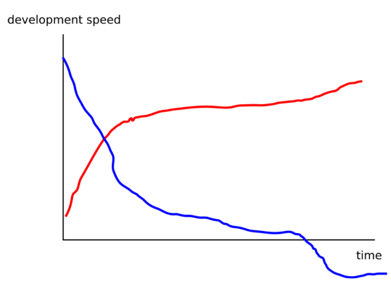

# Introduction to 'How to write good code'
#### Timing
15 min

## Introduction
Use [these slides](../files/01-introduction-slides.pptx) to introduce the workshop.

This workshop will teach you how to do software engineering instead of scripting/programming.
We will teach you tools and skills that will help you increase development speed over time 
and create higher quality software.

See below plot (also in the slides)

The red line is with software engineering best practices, blue line is without.
Initially without software engineering tools development speed is high,
but it quickly drops as the project grows more complex.
Instead if you use the right tools and skills the development speed will increase once you get further in a project.

But, all projects are different. A lot of the tools and skills we teach are useful in complex long-running projects, 
but can add unnecessary overhead in short-lived, simple projects.

We will refer to the rationale of this introduction throughout the workshop.

### Key Points
* Software engineering tools and skills can increase development speed over time
* You don't always need to apply all the best practices. 
   For simple short-lived projects it is not always worth the investment.
